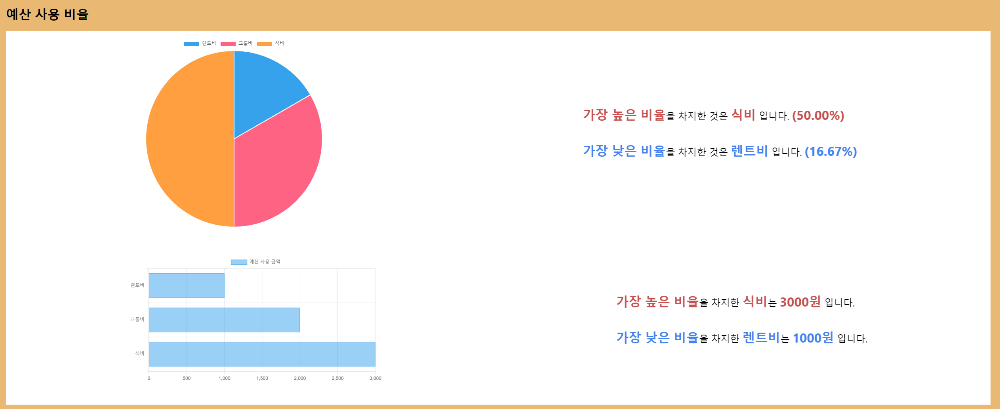

# React_CRUD_Application
## 예산 계산기

### 사용 언어
- HTML, CSS, Javascript, ReactJS 

### 사용 library
- fontawesome : button icon 사용
    - npm i --save @fortawesome/fontawesome-svg-core
    - npm install --save @fortawesome/free-solid-svg-icons
    - npm install --save @fortawesome/react-fontawesome
- styled-component : 컴포넌트에 styling
    - npm install --save styled-components
- chart.js
    - npm install react-chartjs-2 chart.js

- 메인 기능
  
    
    
    
    1. 예산 항목 추가
    
        
    2. 예산 조회
    3. 항목 수정
       
    
    
    
    4. 항목 삭제
      
    
    
    5. 모든 항목 지우기
    6. Chart 기능
        - pie chart : 가장 높은 비율과 가장 낮은 비율의 항목 명시
        - bar chart : 가장 높은 금액과 가장 낮은 금액의 항목 명시
